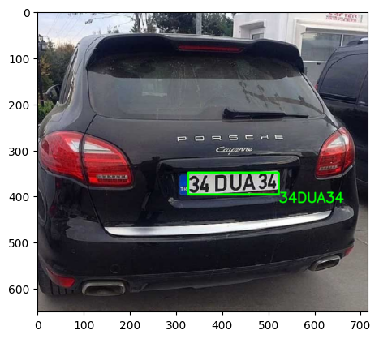
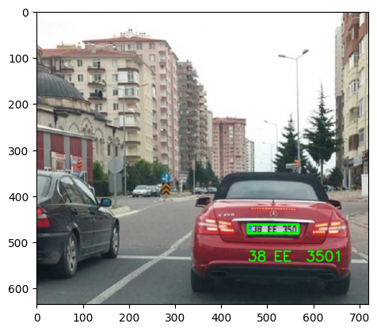
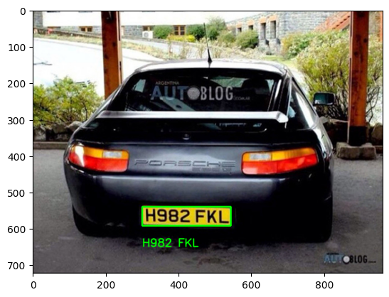
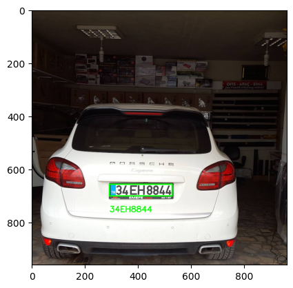

# Plate Recognition Using OpenCV and EasyOCR

## Overwiew

This project implements ANPR using EasyOCR, a Python package for Optical Character Recognition (OCR). The program takes an image containing a license plate as an input, and outputs the recognized text of the license plate along with a bounding box around it.

The ANPR system implemented in this project uses computer vision techniques to process the input image. The image is first converted to grayscale, and then filtered using a bilateral filter. The Canny edge detection algorithm is then applied to the filtered image to detect the edges of the license plate.

Then, contours are extracted from the edge-detected image, and the contour with four corners is selected as the license plate. A bounding box is drawn around the license plate, and the region of interest (ROI) is extracted from the original image. The ROI is then passed to the EasyOCR library for text recognition.

The recognized text of the license plate is then displayed on the output image along with the bounding box. The program provides a simple yet effective solution for ANPR, which can be used in various applications.

## Getting Started

### Requirements

Python 3.9

- OpenCV
- Matplotlib
- Numpy
- Imutils
- EasyOCR

### Installation

- Clone the repository

`git clone https://github.com/fatihbulbul1/plate_recognition.git`

- Install the required packages

`pip install -r requirements.txt`

## Examples

